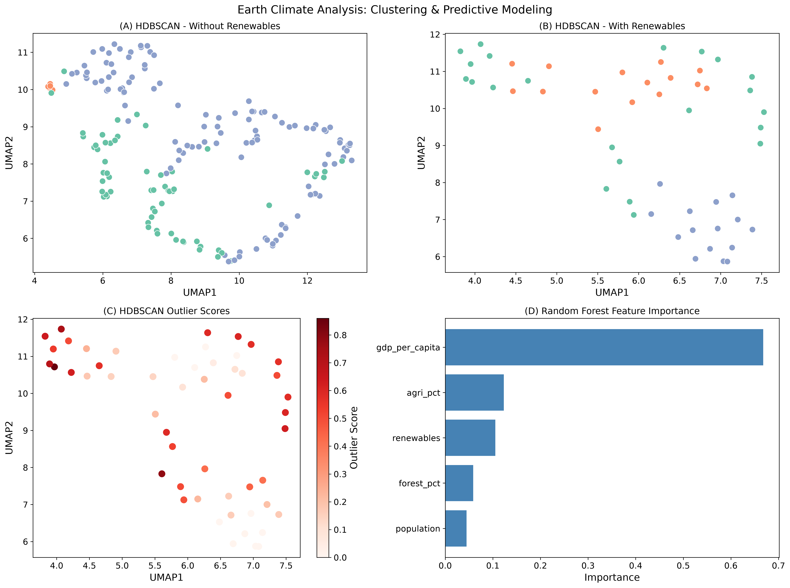

Earth Climate Observations

A collection of geospatial and environmental data analysis applications using Python. 

Repository Structure
data/ - datasets
notebooks/ - exploratory analysis
src/ - reusable code
figures/ - generated plots and maps

Current Project titled "Earth Climate Analysis Using Environmental and Economic Indicators"

This project applies statistical analysis, ML and data visualisations to understand how development, land use and energy structure related to CO2 emissions and wehter countries can be clustered into specific related profiles.

Key Questions:
1- Which countries emit the most CO2 per person?
2- What is the relationships between GDP, population, forests, agriculture, renewable energy consumption and emissions?
3- Can countries be clustered into specific related profiles?
4- Which factors are strongly correlated with emission?

The project currently uses the following data from World Bank Open Data:
CO2 contribution per capita: https://data.worldbank.org/indicator/EN.GHG.CO2.PC.CE.AR5   
CO2 global contribution: https://data.worldbank.org/indicator/EN.GHG.CO2.MT.CE.AR5
Forest area: https://data.worldbank.org/indicator/AG.LND.FRST.ZS
Agricultural area: https://data.worldbank.org/indicator/AG.LND.AGRI.ZS
Renewable energy consumption: https://data.worldbank.org/indicator/EG.FEC.RNEW.ZS
GDP per capita: https://data.worldbank.org/indicator/NY.GDP.MKTP.KD
Population: https://data.worldbank.org/indicator/SP.POP.TOTL

Project Workflow:
1- Data gathering and clearning
2- Statistical and correlation estimations
3- Visualisations
4- Supervised and unsupervised learning analysis

Tools and Components:
1- Data Processing using pandas, geopandas
2- Statistics, scatter plots, heatmaps and geographic mapping using seaborn, umap and matplotlip
3- HDBSCAN clustering and GLOSH outlier detection (unsupervised learning) using hdbscan library in Python
4- Random forest and feature importance (supervised learning) using sklearn library in Python

Notes: 
The dataset renewable energy consumption contains significant missing data, therefore the HDBSCAN clustering was performed in one run without this variable and in the next with the full avaiable datasets.

**KEY FINDINGS**:
**Derived Patterns**
* CO₂ per capita, GDP per capita, and population are **highly right-skewed**
* Large-scale inequalities are present in emission, income and population size.
* Forest and agriculture variables are uniform and symmetric.
➡️ **Climate change impact is highly concerntrated in a small cluster of high income and high population countries.**

**Correlations**
* GDP ↔ CO₂ per capita: moderate positive (~0.47)
* Renewables ↔ GDP: moderate negative (~-0.50)
* Forest ↔ Agriculture: moderate negative (~-0.48)
* Renewables ↔ CO₂: weak negative (~-0.21)
➡️ **High income countries contribute significantly more to emissions, while the correlation between forest and agriculture is expected. On the other hand, even though renewable energy consumption has lower than expected correlation, one should keep in that this dataset suffers from siginifcant lack of coverage for all countries.**

**Land Dynamics**
* Countries with large number of forests often have minimal agriculture, such as Gabon and Suriname.
* Few high income developed countries maintain high forest area, such as Japan and Sweden.
* Clear trade-off between forest and agricultural land use.
➡️ **Land dynamics are not only driven by income level, but also geography and development.**

**Renewable Energy vs CO2 Emission**
* Most countries cluster at lower values ~ less than 10 tons CO2 per capita.
* No strong relationship found between the two variables and outlier domination is apparent.
➡️ **No conclusive statements can be derived as the renewable energy consumption datasets lacks coverage of all countries. Therefore, more data and coverage are required to draw a solid conclusion.**

**Supervised Machine Learning**
* **R² ≈ 0.65**
* Model explains moderate share of variance in emissions
Feature importance:

1. GDP per capita (~0.67)
2. Agriculture (~0.12)
3. Renewables (~0.10)
4. Forest area (~0.06)
5. Population (~0.04)

➡️ **Economic development is the major driver of emissions**

**Unsupervised Machine Learning**
Two clustering configuartions were compared:
1- Without renewable energy consumption
Weak unstable clustering with DBCV = 0.189 and limited separations.
2- With renewable energy consumption
Clearer and better structured clustering with DBCV = 0.330. The clusters span low-income agrarian countries, middle-income countries and high income (outlier) countires.

➡️ **Adding renewable energy consumption rates allows for better structuring and more meaningful interpretations.**

**Main Conclusion**
**Economic development is the dominate and primary driver of CO2 emissions, while lang dynamics and renewable energies provide minor patterns. On the other hand, the machine learning algorithms result point to the same conclusion, while also revealing some clear environmental-economic archetypes.**

## 📊 Summary Figure

Author

Dr. Basel Ali
